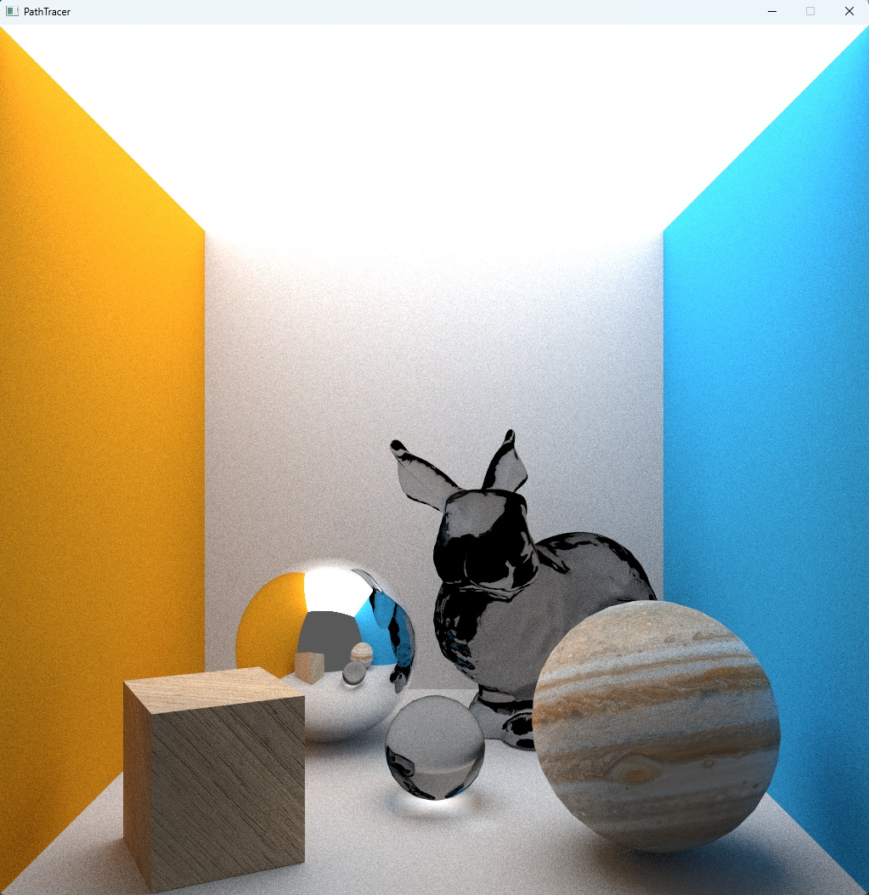

# CPU Path Tracer

A high-performance CPU-based path tracer written in C++ with multi-threading, anti-aliasing, and kd-tree acceleration structure. The project utilizes CMake for building and is capable of rendering realistic global illumination effects with depth of field, outputting images from 3D scenes described in COLLADA format.



## Features

- **Multi-threaded Rendering**: Speed up rendering by utilizing multiple CPU cores.
- **Anti-aliasing**: Supports multi-sample anti-aliasing (MSAA) to smooth edges and reduce jaggedness in the image.
- **K-d Tree with Surface Area Heuristic (SAH)**: Accelerates ray-scene intersection tests, improving performance for complex scenes tremendously.
- **Global Illumination**: Simulates realistic light interactions including reflections, refractions, and shadows.
- **Depth of Field**: Adds realistic camera effects by simulating focus on a specific distance with an adjustable aperture.
- **Textures**: Supports UV texture mapping to add detail and realism to surfaces.
- **Reflection**: Simulates reflective surfaces for accurate mirror-like effects.
- **Refraction**: Handles light bending through transparent materials to simulate glass and water.
- **Image Output**: Saves the final rendered image to a file.

## Requirements

- C++17 or higher
- CMake 3.16 or higher
- A C++ compiler supporting multi-threading (e.g., GCC, Clang, MSVC)

## Dependecies
This project relies on several third-party libraries for handling model loading, image processing, testing, and window management:

- **[Assimp](https://github.com/assimp/assimp)**: Used for importing 3D model formats (e.g., DAE, FBX). It supports a wide range of file formats, making it easy to load complex scenes and models.
- **[stb_image](https://github.com/nothings/stb)**: A simple header-only library for loading images (e.g., textures) in various formats (PNG, JPG, BMP). In this project it is also used to save the framebuffer to an image file.
- **[SDL2](https://www.libsdl.org/)**: Handles window creation and input, making it easier to interact with the rendered scene.
- **[googletest](https://github.com/google/googletest)**: A testing framework for unit testing the path tracer's individual components.

### Prebuilt Libraries for Windows

Prebuilt libraries for `Assimp`, `SDL2`, and `googletest` are included in the repository under the `libs/` and `dll/` directories for **Windows** users. You can use these directly to avoid the hassle of building them manually on Windows. Since `stb_image` is a head-only library, it is built along with the project itself.

For other platforms, such as Linux or macOS, you can install these libraries using package managers or build them from source.

### Installing Dependencies on Linux/macOS
If you're using Linux or macOS, you will need to install these dependencies via package managers or by building them manually.

#### Assimp:
```bash
sudo apt-get install libassimp-dev   # Ubuntu
brew install assimp                  # macOS
```
#### stb_image
stb_image is header-only, so you do not need to install it separately. It is included in the source code and automatically integrated during compilation.

#### googletest
```bash
sudo apt-get install libgtest-dev    # Ubuntu
brew install googletest              # macOS
```

### Adding Libraries to Your Build (Linux/macOS)
On Linux/macOS, you can link these libraries in your CMakeLists.txt by ensuring the libraries are found by CMake:
```cmake
find_package(assimp REQUIRED)
find_package(SDL2 REQUIRED)
find_package(GTest REQUIRED)

target_link_libraries(path_tracer PRIVATE assimp SDL2 GTest::GTest)
```

## Build Instructions

1. Clone the repository:
    ```bash
    git clone https://github.com/THaenlein/path-tracer.git
    cd path-tracer
    ```

2. Create a build directory and run CMake:
    ```bash
    mkdir build
    cd build
    cmake ..
    ```

3. Compile the project:
    ```bash
    make
    ```

4. Run the path tracer:
    ```bash
    ./PathTracer --input <path-to-collada-scene-file> --width <render-width> --height <render-height> --max-samples <number-of-max-samples> --max-depth <max-ray-depth> --use-anti-aliasing --threading <number-of-threads>
    ```

## Configuration

In `settings.hpp`, the following macros control the behavior of the path tracer:

- **USE_ACCELERATION_STRUCTURE**:
  - When defined, the path tracer will use the K-d Tree acceleration structure to optimize ray-object intersection tests.
  - This acceleration structure is critical for improving performance, especially in complex scenes with many objects.
  - Disabling this will fall back to a brute-force method of testing each ray against all triangles, which can significantly slow down rendering.
  
  ```cpp
  #define USE_ACCELERATION_STRUCTURE 1
  ```
- **PATH_TRACE**:
  - This macro enables the path tracing rendering technique, which simulates global illumination by tracing rays as they bounce through the scene, gathering light from direct and indirect sources.
  - If disabled, the path tracer may revert to a simpler form of ray tracing, without the full global illumination effects.
  ```cpp
  #define PATH_TRACE 1
  ```

## Command Line Arguments

- `--input <path>`: Path to the COLLADA scene file (required). E.g: `res/testScene_path_trace_bunny.dae`
- `--width <render-width>`: Width of the output image in pixels (default is 512).
- `--height <render-height>`: Height of the output image in pixels (default is 512).
- `--max-samples <samples>`: Maximum number of samples per pixel for more accurate lighting (default is 4).
- `--max-depth <depth>`: Maximum recursion depth for rays (default is 4).
- `--bias <float>`: Bias value to avoid shadow acne, usually a small float (default is 0.001).
- `--aperture <float>`: Aperture size for depth of field effect (default is 0 for no depth of field).
- `--focal <float>`: Focal distance for depth of field (only used if aperture > 0).
- `--use-anti-aliasing`: Enable multi-sample anti-aliasing if set (default is not set).
- `--threading <threads>`: Number of threads to use for rendering (default is 1).

## Example Usage

```bash
./path_tracer --input res/testScene_path_trace_bunny.dae --width 1024 --height 1024 --max-samples 8 --max-depth 5 --bias 0.001 --aperture 0.01 --focal 1.5 --use-anti-aliasing  --threading 8
```
This will render the scene testScene_path_trace_bunny.dae at 1024x1024 resolution with 8 samples per pixel, max of 5 ray bounce depth, an aperture of 0.01, a focal distance of 1.5 units, with anti-aliasing enabled, and using 8 threads for parallel rendering.

## Features in Detail

### Multi-threaded Rendering
The path tracer is optimized for multi-threading, leveraging modern CPU architectures to distribute pixel rendering across multiple cores. This significantly reduces the time required to complete a render.

### Anti-aliasing
By enabling MSAA, the path tracer distributes ray samples within a pixel to reduce visual artifacts, such as jagged edges, resulting in smoother and more polished images.

### K-d Tree with Surface Area Heuristic (SAH)
An optimized spatial acceleration structure is employed to minimize the number of ray-object intersection tests, improving performance in complex scenes with many objects. The Surface Area Heuristic ensures efficient space splitting to further reduce intersection tests. See the corresponding paper [On building fast kd-Trees for Ray Tracing, and on doing that in O(N log N)](https://www.sci.utah.edu/~wald/Publications/2006/NlogN/download/kdtree.pdf). 

### Global Illumination
The path tracer supports global illumination, simulating complex light interactions, including indirect lighting, reflections, and refractions. This results in more realistic lighting and shadowing.

### Depth of Field
Simulates camera focus by allowing users to specify aperture size and focal distance. Objects at the focal distance appear sharp, while those closer or farther from the camera appear blurred, mimicking real-world depth of field effects.

### Image Output
The final image is saved in a standard format (e.g., PNG or JPEG) for easy viewing and sharing. Output format and path can be easily customized within the code.

## TODO
- [ ] **SIMD Optimization**: Implement SIMD (Single Instruction, Multiple Data) to further optimize the math-heavy sections of the code for better performance.
- [ ] **K-d Tree in O(n log n)**: Improve K-d Tree construction algorithm to achieve `O(n log n)` complexity for faster build times.
- [ ] **Decouple Math from Assimp**: Separate the math utilities and structures from the Assimp library to reduce dependencies and increase flexibility.


## Contributing
Feel free to submit issues, fork the repository, and make pull requests. Contributions are welcome!

## License
This project is licensed under the MIT License. See the LICENSE file for details.
